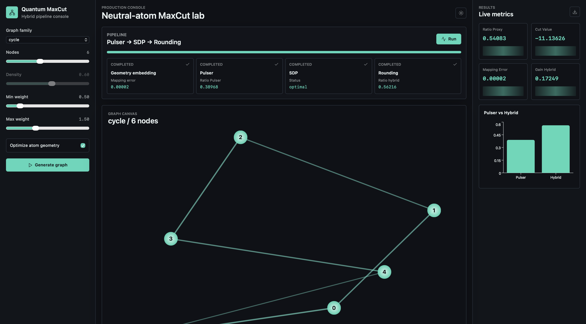
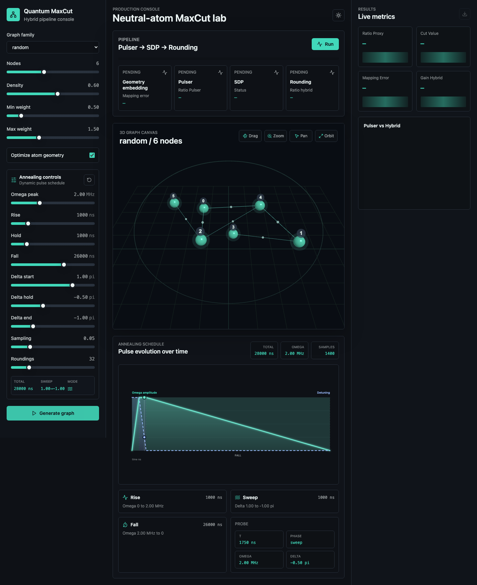
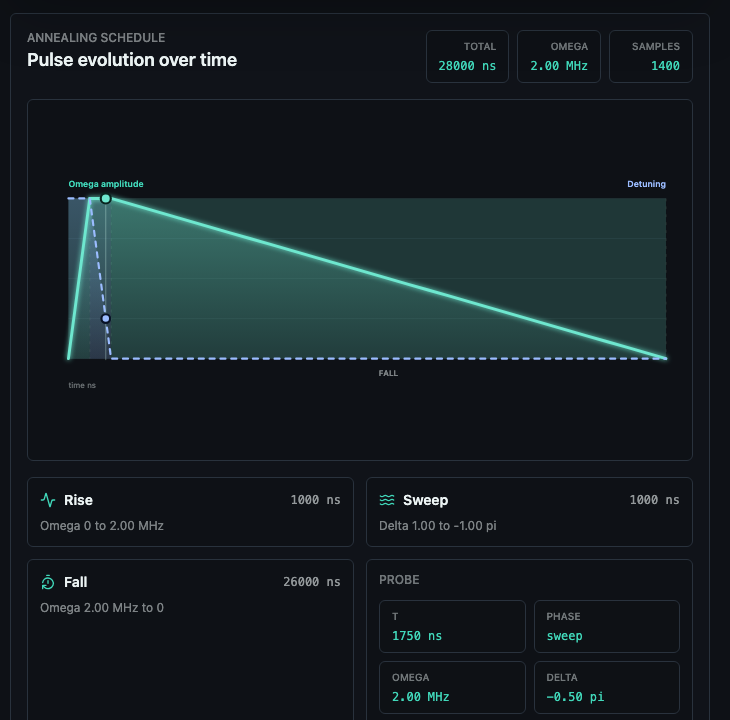

# Quantum MaxCut Lab

> Modern software console for neutral-atom MaxCut experiments: graph generation, geometry embedding, annealing control, Pulser-style proxy evaluation, SDP relaxation, hybrid rounding and live metrics.

[](https://www.python.org/)
[](https://fastapi.tiangolo.com/)
[](https://react.dev/)
[](https://www.typescriptlang.org/)
[](https://threejs.org/)
[](https://vitejs.dev/)
[](https://www.docker.com/)



## Overview

Quantum MaxCut Lab is the software application layer built from the research project [`karimelhoudaigui/quantum-maxcut`](https://github.com/karimelhoudaigui/quantum-maxcut).

The original project focuses on the mathematical and experimental pipeline. This repository presents the same work as a modern, usable software console: a FastAPI backend, a React/TypeScript frontend, live pipeline jobs, graph visualization, dynamic annealing sliders and production-style metrics.

The application is designed for small neutral-atom MaxCut experiments where exact simulation, optimization and SDP are still tractable. It gives researchers and reviewers a single interface to move from a graph instance to a full Pulser → SDP → rounding comparison.

## Software In Action

The console is designed as a research cockpit: graph construction, annealing design, pipeline execution and metrics remain visible in the same workspace. The left rail controls the experiment, the center column shows the live pipeline and geometry, and the right rail keeps the current result metrics available while the user iterates.



The generated graph is rendered as an interactive Three.js scene. The view keeps the optimized atom layout readable while adding depth, labels and weighted links so the user can rotate, zoom and inspect the instance before running the quantum/hybrid pipeline.



The annealing visual replaces the old empty structure table. It shows the pulse as a time-domain object: `rise`, `sweep` and `fall` phases are visible, while the two curves expose how the Rabi amplitude and detuning evolve under the current slider configuration.

## Core Workflow

1. Select a graph family: `path`, `cycle`, `star`, `complete` or `random`.
2. Tune graph parameters: number of nodes, density and edge-weight range.
3. Generate a weighted graph and optional optimized atom coordinates.
4. Adjust annealing parameters with modern sliders.
5. Move the graph in the 3D canvas: drag to rotate, scroll to zoom, pan to reposition.
6. Run the full hybrid pipeline.
7. Watch progress across geometry embedding, Pulser proxy, SDP and rounding.
8. Inspect live metrics: mapping error, proxy ratio, hybrid ratio, cut value and hybrid gain.

## Software Features

- **Interactive graph generation** with weighted graph families.
- **3D graph canvas** powered by Three.js, with orbit, zoom and pan controls.
- **Atom geometry optimization** to map graph weights into distance-dependent neutral-atom couplings.
- **Dynamic annealing control** through sliders for pulse amplitude, durations, detuning sweep and sampling.
- **Pulser-style quantum proxy evaluation** for Rydberg-inspired XY dynamics.
- **SDP reconstruction** using proxy correlators.
- **Hybrid rounding** to compare rounded MaxCut candidates against proxy behavior.
- **Live pipeline status** with queued, running, completed and failed states.
- **Modern React console** with a dense research-dashboard layout.
- **FastAPI backend** with typed request/response schemas.
- **Docker Compose support** for one-command launch.
- **Python-only dashboard fallback** when Node.js or Docker are not available.

## Annealing Controls

The left control panel contains an `Annealing controls` block. These sliders are part of the same software console and are sent to the backend when the user clicks `Run`.

| Control | Meaning | Backend field |
| --- | --- | --- |
| `Omega peak` | Peak Rabi amplitude in MHz before conversion to angular units | `omega_peak_mhz` |
| `Rise` | Ramp-up duration | `rise_duration` |
| `Hold` | Plateau duration | `hold_duration` |
| `Fall` | Ramp-down duration | `fall_duration` |
| `Delta start` | Initial detuning in units of pi | `delta_start_pi` |
| `Delta hold` | Hold detuning in units of pi | `delta_hold_pi` |
| `Delta end` | Final detuning in units of pi | `delta_end_pi` |
| `Sampling` | Pulse sampling rate used by the simulation pipeline | `sampling_rate` |
| `Roundings` | Number of randomized hybrid rounding attempts | `n_roundings` |

The backend converts slider values into the pulse dictionary consumed by the Pulser/hybrid experiment:

```python
omega_peak = 2 * pi * omega_peak_mhz
delta_start = pi * delta_start_pi
delta_hold = pi * delta_hold_pi
delta_end = pi * delta_end_pi
```

The final pipeline result stores the annealing configuration used for the run, making experiments reproducible from the UI state.

The schedule panel is intentionally more product-oriented than Pulser's default drawing output. It keeps the same physical meaning as a sequence built from ramp waveforms, but it is tuned for a software interface: high contrast, phase bands, hover probe values and live updates as the sliders move.

Conceptually, the displayed schedule corresponds to the familiar Pulser pattern:

```python
rise = pulser.Pulse.ConstantDetuning(
    pulser.RampWaveform(t_rise, 0.0, Omega_max),
    delta_0,
    0.0,
)
sweep = pulser.Pulse.ConstantAmplitude(
    Omega_max,
    pulser.RampWaveform(t_sweep, delta_0, delta_f),
    0.0,
)
fall = pulser.Pulse.ConstantDetuning(
    pulser.RampWaveform(t_fall, Omega_max, 0.0),
    delta_f,
    0.0,
)
```

In the UI, this becomes a continuous visual timeline:

- `Rise`: amplitude ramps from `0` to `Omega_max` while detuning is held at the initial value.
- `Sweep`: amplitude stays constant while detuning moves from `delta_0` to `delta_f`.
- `Fall`: amplitude ramps back to `0` while the final detuning is held.

## 3D Graph Canvas

The graph view is an interactive Three.js scene. Generated graph nodes are rendered as glowing 3D spheres, weighted edges are rendered as luminous links and labels stay attached to the nodes.

Controls:

| Action | Interaction |
| --- | --- |
| Rotate/orbit | Drag with the mouse or trackpad |
| Zoom | Mouse wheel or trackpad pinch/scroll |
| Pan | Right-click drag, middle-click drag or two-finger trackpad pan |
| Reset by regeneration | Generate another graph to reframe the camera around the new instance |

The 3D projection keeps the optimized atom layout as the base geometry and adds depth from graph structure, so high-connectivity nodes become easier to inspect. This makes the graph easier to explore during demos and while comparing geometry embedding quality against downstream Pulser/hybrid metrics.

## Architecture

```text
.
├── api/
│   ├── main.py                    # FastAPI app, CORS, routers
│   ├── schemas.py                 # Typed request/response models
│   ├── routers/
│   │   ├── graph.py               # Graph generation endpoint
│   │   └── pipeline.py            # Pipeline job endpoints
│   └── services/
│       └── pipeline_service.py    # Graph generation, job registry, pipeline execution
│
├── app/
│   ├── src/
│   │   ├── components/            # React console panels
│   │   ├── hooks/                 # React Query pipeline hooks
│   │   ├── lib/api.ts             # API client and Vite proxy usage
│   │   ├── stores/                # Zustand pipeline state
│   │   ├── types.ts               # TypeScript domain types
│   │   └── styles.css             # Tailwind and modern slider styling
│   ├── package.json               # React, Vite, Three.js and dashboard dependencies
│   └── vite.config.ts             # Dev proxy for /api
│
├── quantum_hybrid/                # SDP and hybrid rounding core
├── quantum_pulser/                # Pulser-style pulse and proxy utilities
├── frontend/                      # Legacy static dashboard
├── scripts/                       # Experiment runners
├── assets/software-preview.png    # README preview image
├── assets/screenshot-console-3d-graph.png
├── assets/screenshot-annealing-schedule.png
├── docker-compose.yml             # API + app stack
├── quantum_main.py                # Research runner
├── quantum_utils.py               # Hamiltonians, Pauli operators, exact utilities
└── requirements.txt               # Python dependencies
```

## Run With Docker

Docker is the easiest way to launch both services together.

```bash
docker compose up
```

Open:

```text
http://localhost:5173
```

Services:

```text
Frontend: http://localhost:5173
API:      http://localhost:8000
Docs:     http://localhost:8000/docs
Health:   http://localhost:8000/api/health
```

Stop:

```bash
docker compose down
```

## Run Without Docker

Use this mode when Docker is not installed.

### Backend

```bash
cd quantum-maxcut-lab
python -m venv .venv
source .venv/bin/activate
python -m pip install -r requirements.txt
python -m uvicorn api.main:app --reload --port 8000
```

### Frontend

Open a second terminal:

```bash
cd quantum-maxcut-lab/app
npm install
npm run dev
```

Open:

```text
http://localhost:5173
```

If port `5173` is already used, Vite may choose `5174` or another port. The backend now allows local development ports dynamically, and the frontend proxies `/api` requests to the configured backend.

## Run With A Custom API Port

If port `8000` is busy:

```bash
python -m uvicorn api.main:app --host 127.0.0.1 --port 8001
```

Then start the frontend with:

```bash
cd app
VITE_API_BASE_URL=http://127.0.0.1:8001 npm run dev
```

The frontend still calls `/api/...`; Vite forwards those calls to the configured backend target.

## Python-Only Dashboard

The repository also includes a lightweight dashboard that does not require Node.js.

```bash
source .venv/bin/activate
python quantum_frontend.py
```

Open:

```text
http://127.0.0.1:8765
```

This dashboard is useful for inspecting existing experiment output files and plots. The React console in `app/` is the main software interface.

## API Endpoints

### Health

```http
GET /api/health
```

Response:

```json
{
  "status": "ok"
}
```

### Generate Graph

```http
POST /api/graph/generate
```

Example payload:

```json
{
  "family": "cycle",
  "n_nodes": 6,
  "density": 0.6,
  "weight_min": 0.5,
  "weight_max": 1.5,
  "seed": 42,
  "optimize_geometry": true
}
```

The response contains weighted edges, node positions, optional mapping error and graph descriptors.

### Run Pipeline

```http
POST /api/pipeline/run
```

Example payload:

```json
{
  "graph": {
    "family": "cycle",
    "n_nodes": 6,
    "edges": [
      { "i": 0, "j": 1, "w": 1.2 }
    ],
    "positions": [
      { "id": 0, "x": 0.0, "y": 1.0 }
    ],
    "mapping_error": 0.00002,
    "descriptors": {}
  },
  "annealing": {
    "omega_peak_mhz": 2.0,
    "rise_duration": 1000,
    "hold_duration": 1000,
    "fall_duration": 26000,
    "delta_start_pi": 1.0,
    "delta_hold_pi": -0.5,
    "delta_end_pi": -1.0,
    "sampling_rate": 0.05,
    "n_roundings": 32
  },
  "n_roundings": 32,
  "seed": 1234
}
```

The endpoint returns a job id immediately. The computation runs in the background.

### Poll Pipeline Status

```http
GET /api/pipeline/{job_id}/status
```

The response includes:

- job status: `queued`, `running`, `completed` or `failed`;
- progress percentage;
- step metrics;
- final result payload once completed;
- error text if the run fails.

### Family Results

```http
GET /api/results/{family}
```

Reads available graph-family summary files when they exist.

## Research Core

The main target Hamiltonian is the Quantum MaxCut Hamiltonian:

```math
H_{\mathrm{qmc}} = - \sum_{(i,j)\in E} w_{ij}
\left(I - X_i X_j - Y_i Y_j - Z_i Z_j\right)
```

The neutral-atom proxy uses distance-dependent XY couplings:

```math
H_r = \sum_{(i,j)\in E} J_{ij}
\left(X_i X_j + Y_i Y_j\right),
\qquad J_{ij} = \frac{C_3}{r_{ij}^3}
```

The geometry optimization minimizes the mismatch between graph weights and Rydberg couplings:

```math
f(\mathbf r) =
\sqrt{
  \frac{
    \sum_{(i,j)} \left(J_{ij}(\mathbf r) - w_{ij}\right)^2
  }{
    \sum_{(i,j)} w_{ij}^2
  }
}
```

The hybrid layer uses proxy correlators to construct an SDP relaxation over pseudo-moment variables, then applies rounding to recover MaxCut-style candidate assignments.

## Troubleshooting

### `Failed to fetch` when clicking `Generate graph`

This usually means the browser cannot reach the API, or CORS/proxy configuration is wrong.

Check the backend:

```bash
curl http://127.0.0.1:8000/api/health
```

If the backend is running on `8001`, start the frontend with:

```bash
VITE_API_BASE_URL=http://127.0.0.1:8001 npm run dev
```

If Vite starts on `5174` instead of `5173`, that is fine. The API allows local ports and the Vite proxy forwards `/api` correctly.

### `npm: command not found`

Install Node.js LTS:

```bash
brew install node
```

or install it from:

```text
https://nodejs.org/
```

### `docker: command not found`

Install Docker Desktop for Mac:

```text
https://www.docker.com/products/docker-desktop/
```

Then restart the terminal.

### `python: command not found`

Use:

```bash
python3 -m venv .venv
source .venv/bin/activate
python3 -m pip install -r requirements.txt
```

### Port already in use

Use another API port:

```bash
python -m uvicorn api.main:app --port 8001
```

and point Vite to it:

```bash
VITE_API_BASE_URL=http://127.0.0.1:8001 npm run dev
```

## Validation

Frontend build:

```bash
cd app
npm run build
```

Backend import/compile check:

```bash
PYTHONPYCACHEPREFIX=/tmp/quantum-maxcut-pycache python3 -m compileall api
```

Quick graph-generation check through the Vite proxy:

```bash
curl -X POST http://localhost:5173/api/graph/generate \
  -H "Content-Type: application/json" \
  -d '{
    "family": "cycle",
    "n_nodes": 6,
    "density": 0.6,
    "weight_min": 0.5,
    "weight_max": 1.5,
    "seed": 42,
    "optimize_geometry": true
  }'
```

If Vite is running on `5174`, replace `5173` by `5174`.

## Experiment Scripts

Run the selected research mode:

```bash
source .venv/bin/activate
python quantum_main.py
```

Run the graph-family hybrid pipeline:

```bash
python scripts/run_graph_family_full_pipeline.py --n 4 --num-instances 100 --seed 123
```

## Relationship To The Original Project

This repository is the software-console version of the research system described in [`karimelhoudaigui/quantum-maxcut`](https://github.com/karimelhoudaigui/quantum-maxcut).

It keeps the same scientific direction while emphasizing:

- a visible application surface;
- reproducible local launch commands;
- a clean GitHub presentation;
- dynamic annealing controls;
- API-driven workflow execution;
- software-style architecture for demos and review.

## License

MIT License.
